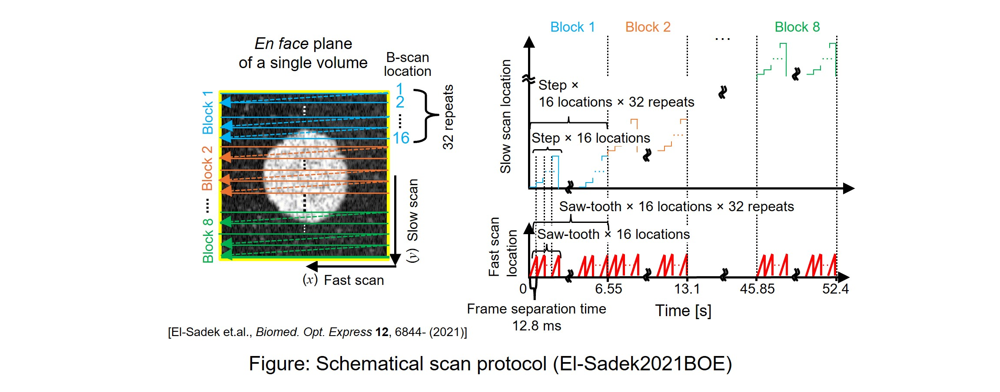
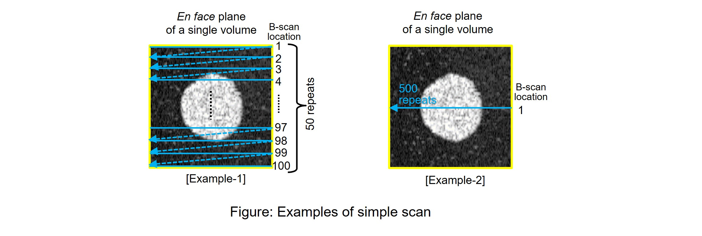

Usage of COG-dynamic-OCT-contrast-generation-library (COG DOCT-CG library)
====================================================

About COG DOCT-CG library
------------------
The COG DOCT-CG library is a Python library which provides the classes and functions to compute several dynamic optical coherence tomography (DOCT) contrasts from a time-sequence of linear-scale OCT intensity images.

### Available DOCT contrasts
- authentic LIV (aLIV)
- Swiftness
- The detailed methods of aLIV and Swiftness can be found in [Morishita et al., arXiv(2024)](https://doi.org/10.48550/arXiv.2412.09351).

### Functions to compute each algorithm
- aLIV, Swiftness : vliv_postprocessing () (included in "COG-DOCT/Program/VLIV" folder)

Preparation steps for processing
--------------------------------
### Avairable OCT data
- Time-sequential linear-scaled OCT intensity data
- Data type: `float 32`
- Data shape: 3D array, [time, z, x] or [time, x, z].

### Main program
**main()** function in **main.py** is used for butch processing.
### Inputs of vliv_postprocessing ()
**vliv_postprocessing ()** function requires following inputs:
- **path_OCT:** (required) File path of linear OCT intensity

	##### [Scanning parameters of input data]
	The following parameters are defined based on a scanning protocol in in [El-Sadek2021BOE](https://doi.org/10.1364/BOE.440444) paper. But, we have attempted to generalize this program as much as possible. So, by carefully setting these parameters, time-sequential OCT data obtained by any scanning protocol can be processed using this program. Some examples of scanning parameter at the end of this manual might be also helpful.
- **volumeDataType:** (required) Either "Ibrahim2021BOE" or "BSA".
        Please select it according to the scanning protocol of the input data. "Ibrahim2021BOE" corresponds to the scanning protocol in [El-Sadek2021BOE](https://doi.org/10.1364/BOE.440444) paper, and also simple scanning protocols, i.e., repeating raster scan in a single volume and repeating scan at a single B-scan location. "BSA" corresponds to burst scanning protocol that consists of multiple interframe time.
- **frameSeparationTime:** (required) float; Successive frame measurement time [s]. You can calculate as summation of acquisition time of single B-scan, pullback time, and settle time.
- **frameRepeat:** (required) int; Number of frames in a single burst.
- **bscanLocationPerBlock:** (required) int; Number of Bscan locations per Block.
- **blockRepeat:** (required) int; Number of block repeats.
- **blockPerVolume:** (required) int; Number of blocks in a volume.

	##### [Setting of algorithm imprementation]
- **fitting_method:** (required) Either "CPU" or "GPU". "GPU" uses a GPU-accelerated implementation of function fitting, and is much faster than "CPU" (CPU-based function fitting).
- **alivInitial:** (optional) float; alivInitial will be initial value of a (magnitude) in fitting, defaults as 20.
- **swiftInitial:** (optional) float; 1/swiftInitial will be initial value of b (time constant) in fitting, defaults as 1.
- **bounds:** (optional) 2D tuple; Exploration range of fitting parameters ([min a, min b], [max a, max b]), defaults as ([0,0],[np.inf, np.inf]).
- **use_constraint:** (optional) boolean; "True" sets bounds of fitting parameters in a exploration, while "False" does not set bounds. Default is "True".
- **compute_VoV:** (optional) boolean; "True" computes a variance of all LIVs of identical time window (VoV), which is used for test (debug) and weighted fitting, while "False" does not compute VoV. Default is "False".
- **use_weight:** (optional) boolean; "True" applys a weight for fitting, while "False" does not apply a weight. Make sure if compute_VoV = "True". VoV will be used as the weight. And it should be noted that the weighted fitting has been implemented only in GPU-based fitting (fitting_method = "GPU"). Default is "False".
- **average_LivCurve:** (optional) boolean; "True" averages LIV curves before fitting using 3 * 3 kernel to make the LIV curves smooth and increase the fitting accuracy, while "False" does not average. Default is "True".
- **motionCorrection:** (optional) boolean; "True" applys a bulk-motion correction based on a image registration (Details are in [Morishita2023BOE](https://doi.org/10.1364/BOE.488097) paper), while "False" does not apply. Default is "False".

	##### [Dynamic ranges for pseudo-color image]
- **octRange:** (required) 1D tuple; Dynamic range of dB-scaled OCT intensity, which is used as brightness of pseudo-color image (min, max).
- **alivRange:** (required) 1D tuple; Dynamic range of aLIV, which is used as hue of pseudo-color image (min, max).
- **swiftRange:** (required) 1D tuple; Dynamic range of Swiftness, which is used as hue of pseudo-color image (min, max).

Scanning protocol examples
----------------------------
Here is a schematical figure of scanning protocols and its related scanning parameters.  

In the particulary case of El-Sadek2021BOE and simple-scan examples, the scanning parameters to be input are as follows:
#### El-Sadek2021BOE
volumeDataType = "Ibrahim2021BOE", frameSeparationTime = 12.8, frameRepeat = 1, bscanLocationPerBlock = 16, blockRepeat = 32, blockPerVolume = 8
#### Simple scan example-1
volumeDataType = "Ibrahim2021BOE", frameSeparationTime = 12.8, frameRepeat = 1, bscanLocationPerBlock = 100, blockRepeat = 50, blockPerVolume = 1
#### Simple scan example-2
volumeDataType = "Ibrahim2021BOE", frameSeparationTime = 12.8, frameRepeat = 1, bscanLocationPerBlock = 1, blockRepeat = 500, blockPerVolume = 1  

