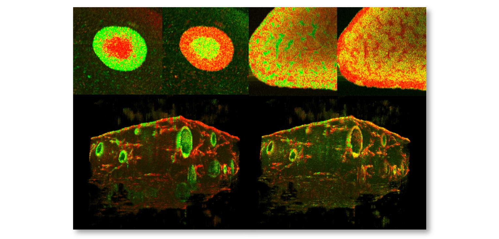

# COG-DOCT
COG-DOCT is for post-processing OCT data with dynamic OCT (DOCT) algorithms. The programs ebables to generate gray-scale and pseudo-color DOCT images from a time-sequential linear-scale OCT intensity image.

Available DOCT contrasts
---------------------------
- authentic LIV (aLIV)
- Swiftness
- Related paper (aLIV, Swiftness): Morishita2024arXiv [[URL](
https://doi.org/10.48550/arXiv.2412.09351)]

### Functions to compute each algorithm
- aLIV, Swiftness : vliv_postprocessing () (included in [postprocess_vliv.py](https://github.com/ComputationalOpticsGroup/COG-DOCT/blob/main/Program/VLIV/postprocess_vliv.py))

Manuals
------------------------
- Usage manual can be found [here](Manual/Usage.md).
- Installation procedure can be found [here](Manual/Instration.md).
- Computation flow in function has been explained [here](Manual/Structure.md).

License
-----------------------
This project is licensed under either of
- (1) GNU LGPLv3 without our permission
- (2) Any license as long as our permission is granted

at your option.

