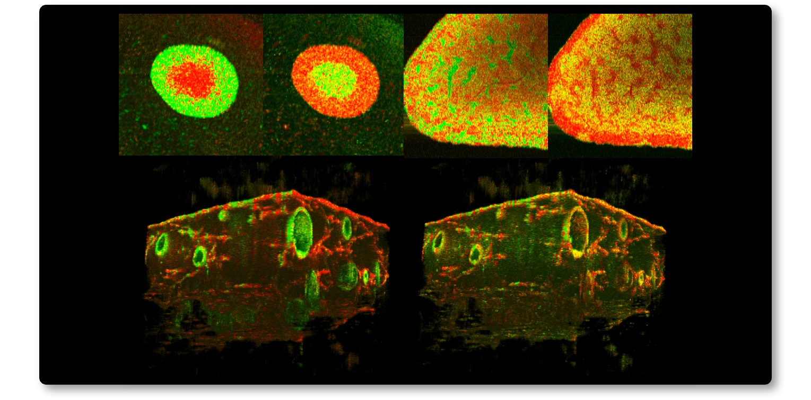

# Dynamic-optical-coherence-tomography contrast-generation library by computational optics group (COG DOCT-CG library) 

The COG DOCT-CG library is a Python library which provides the classes and functions to compute several dynamic optical coherence tomography (DOCT) contrasts from a time-sequence of linear-scale OCT intensity images.

About authors
--------------
This library is released by [Computational Optics Group at the University of Tsukuba](https://cog-news.blogspot.com/), and was developed as a part of our research projects of computationally augmented optical coherence microscope and optical coherence tomography.

Available DOCT contrasts
---------------------------
- authentic logarithmic intensity variance (aLIV).
- Swiftness.
- LIV (coming soon).
- OCT correlation decay speed (OCDS) (coming soon).

- The detailed methods of aLIV and Swiftness can be found in [Morishita et al., arXiv(2024)](https://doi.org/10.48550/arXiv.2412.09351).
- The details of LIV and OCDS can be found at [El-Sadek et al., Biomedical Optics Express (2020)](https://doi.org/10.1364/BOE.404336).

### Functions to compute each algorithm
- aLIV, Swiftness : vliv_postprocessing () (included in [postprocess_vliv.py](Program\VLIV\postprocess_vliv.py))

Manuals
------------------------
- Usage manual can be found [here](Manual/Usage.md).
- Installation procedure can be found [here](Manual/Instration.md).
- Computation flow in function has been explained [here](Manual/Structure.md).

License
-----------------------
This library is licensed under either of the following options.
1. [GNU lesser general public license version 3 (LGPLv3)](LICENSE.md).
2. Any licenses except for GNU LGPLv3 as far as the authors and the uses agree for it. This may include business licenses, closed-source licenses, and others. 
 
Option 1 (GNU LGPLv3) can be selected without notifying the authors. (It is recommended to cite this web-site and the proper reference papers listed in "available DOCT contrasts" sections when you publish research papers using this library.)
If you want to select any other licensing conditions except for GNU LGPLv3 (i.e., Option 2), please contact the corresponding author (Yoshiaki Yasuno, University of Tsukuba, <yoshiaki.yasuno@cog-labs.org>) to obtain an explicit agreement.
